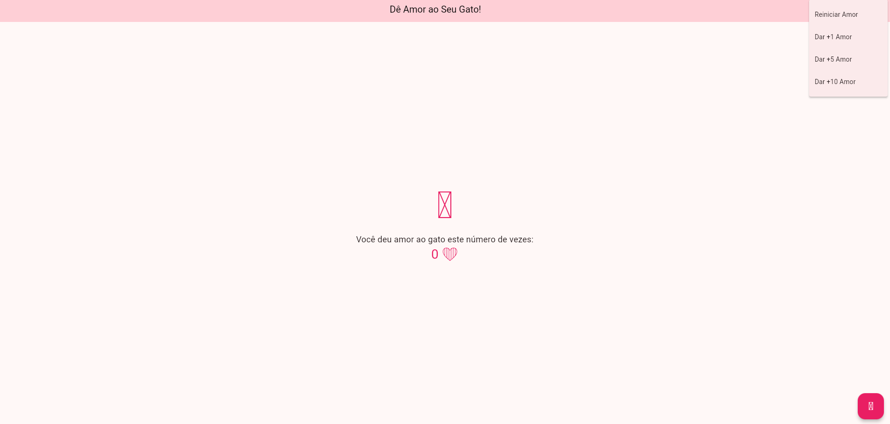

#  Contador de Amor 🐱

Contador de Amor é um contador de cliques simples com um tema fofinho de gato, desenvolvido em Flutter (Dart) e exportado para a Web. Cada clique representa o amor que você deu ao gatinho! 

## 🖼️ Preview do App  

 

🔗**Acesse o Contador de Amor** [Clique aqui para usar o app!](https://avrilstihler.github.io/contador-de-amor/)  

## Funcionalidades  
💗 Ao clicar, o contador aumenta **+1**.  
💗 Menu superior para adicionar **+1, +5 ou +10** de uma vez.  
💗 Botão para **reiniciar a contagem**.  
💗 **Design responsivo**, funcionando bem em celulares e desktops.  

## Problema na versão Web  
Ao exportar o app para a Web, ocorreu um erro que impediu os ícones de aparecerem. Isso prejudica a experiência visual, mas não afeta o funcionamento do contador.  

 

